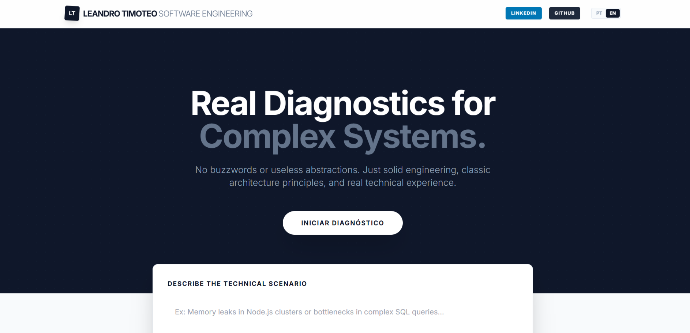

# 🚀 Veteran IT Diagnostic – 2026

I’m pleased to share my latest personal project, focused on intelligent technical diagnostics for IT problems, combining real-world experience with Artificial Intelligence.

Veteran IT Diagnostic is a web application that allows users to describe a technical issue and receive a structured, objective, and solution-oriented analysis, with support for English and Portuguese.

The goal was to deliver a simple and intuitive user experience, backed by a solid and well-designed architecture, following best practices in Software Engineering.

# 🔧 Main Technologies & Concepts Used

 React + TypeScript — component-based architecture, strong typing, and predictable code

Vite — fast build process and modern development setup

Tailwind CSS — clean, responsive, and consistent UI

AI / LLM Integration (OpenRouter) — structured technical diagnosis generation

State-Oriented Architecture — clear handling of loading, error, and success states

UX Best Practices — “New Diagnosis” flow, state reset, and smooth navigation

Cloud Deployment (Vercel) — simple and efficient production pipeline

Proper separation between build-time and runtime environments

# 🎯 Project Goal

To demonstrate, in practice, my ability to:

Design modern front-end applications

Integrate AI in a functional and responsible way

Think in terms of architecture, UX, and maintainability

Deliver a working product — not just code

# 📌 GitHub Repository
https://github.com/LeandroTimoteo/Veteran-IT-Diagnostic

# 📫 Contact: Leandro Timoteo  Systems Analyst/ Software Engineer

📧 Email: leandrinhots6@gmail.com

💻 GitHub: https://github.com/LeandroTimoteo

📱 

# Veteran-it-diagnostic

# App photo;

